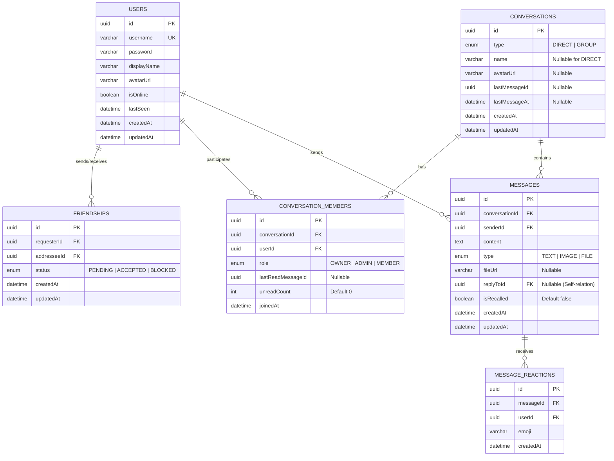

# SPEC.md — ReChat (Real-time Web Messenger)

**Version:** 2.0 · **Ngày:** 06/10/2026 · **Trạng thái:** [x] Draft → [x] Approved

---

## 1. Tổng quan

Xây dựng ứng dụng web nhắn tin thời gian thực (**Real-time Web Messenger**) cho phép người dùng cá nhân kết bạn, trò chuyện trực tiếp 1-1 (**Direct Messaging**), tạo và quản lý nhóm trò chuyện (**Group Chat**) với trải nghiệm giao tiếp hiện đại: trạng thái trực tuyến (Online/Offline presence), hiển thị đang gõ (Typing indicator), trạng thái đã xem (Read receipts), và quản lý hộp thư (Inbox) với bộ đếm tin chưa đọc.

---

## 2. Vai trò (Actors)

| Role | Quyền hạn |
|---|---|
| **Guest** | Đăng ký tài khoản, Đăng nhập hệ thống để nhận JWT Token. |
| **User** | - Xem và cập nhật Profile cá nhân (`displayName`, `avatarUrl`).<br>- Tìm kiếm người dùng khác theo username hoặc tên hiển thị.<br>- Quản lý quan hệ bạn bè: Gửi, Chấp nhận, Từ chối lời mời kết bạn, xem danh sách bạn bè.<br>- Khởi tạo và tham gia cuộc hội thoại 1-1 (Direct Chat) với bạn bè.<br>- Tạo nhóm chat (Group Chat), thêm thành viên, rời nhóm.<br>- Gửi/nhận tin nhắn real-time trong các cuộc hội thoại mà mình tham gia.<br>- Xem lịch sử tin nhắn với phân trang con trỏ (Cursor-based pagination).<br>- Đánh dấu đã đọc tin nhắn trong cuộc hội thoại. |

---

## 3. Functional Requirements

| ID | Module | Tên yêu cầu chức năng |
|----|--------|-----------------------|
| **FR-01** | Auth | Đăng ký tài khoản mới bằng `username`, `password`, `confirmPassword`. |
| **FR-02** | Auth | Đăng nhập hệ thống để nhận JWT Access Token và Profile cơ bản. |
| **FR-03** | Auth | Đăng xuất khỏi hệ thống (`POST /auth/logout`). |
| **FR-04** | Profile | Xem thông tin cá nhân và cập nhật Profile (`displayName`, `avatarUrl`). |
| **FR-05** | Profile | Tìm kiếm người dùng theo `username` hoặc `displayName`. |
| **FR-06** | Friends | Gửi lời mời kết bạn và Hủy/thu hồi lời mời kết bạn đã gửi. |
| **FR-07** | Friends | Chấp nhận hoặc Từ chối lời mời kết bạn nhận được; xem danh sách lời mời (đến và đi). |
| **FR-08** | Friends | Xem danh sách bạn bè kèm trạng thái Online / Offline và `lastSeen`; Hủy kết bạn (Unfriend). |
| **FR-09** | Inbox | Xem danh sách tất cả các cuộc trò chuyện (Inbox), sắp xếp theo tin nhắn mới nhất, hiển thị snippet tin nhắn cuối và số tin chưa đọc (`unreadCount`). |
| **FR-10** | Chat 1-1 | Khởi tạo hoặc mở cuộc trò chuyện 1-1 với một người bạn. |
| **FR-11** | Group Chat | Tạo nhóm chat mới từ danh sách bạn bè (đặt tên nhóm, chọn thành viên ban đầu). Người tạo tự động là `OWNER`. |
| **FR-12** | Group Chat | Quản lý nhóm: Thêm thành viên mới vào nhóm, Rời khỏi nhóm. |
| **FR-13** | Messages | Xem lịch sử tin nhắn của một cuộc hội thoại bằng **Cursor Pagination** (cuộn lên tải thêm tin cũ). |
| **FR-14** | Real-time | Gửi và nhận tin nhắn văn bản tức thì qua WebSocket trong cuộc hội thoại. |
| **FR-15** | Real-time | Hiển thị thông báo khi có người dùng đang gõ tin nhắn (`Typing indicator`). |
| **FR-16** | Real-time | Cập nhật và hiển thị trạng thái đã xem tin nhắn (`Read receipts`). |
| **FR-17** | Real-time | Đồng bộ trạng thái trực tuyến (Online / Offline) và `lastSeen` của bạn bè theo thời gian thực. |

---

## 4. Business Rules ⭐ PHẦN QUAN TRỌNG NHẤT

| ID | Rule | Liên quan FR | Xử lý khi vi phạm |
|----|------|--------------|-------------------|
| **BR-01** | `username` là duy nhất, độ dài từ 3 đến 20 ký tự, chỉ chứa chữ cái, chữ số và gạch dưới `_` (regex: `^[a-zA-Z0-9_]+$`). | FR-01 | `409 Conflict` (trùng) hoặc `400 Bad Request` (sai định dạng) |
| **BR-02** | `password` phải có độ dài tối thiểu từ 6 ký tự. `confirmPassword` phải khớp với `password`. | FR-01, FR-02 | `400 Bad Request` |
| **BR-03** | Không thể tự gửi lời mời kết bạn cho chính mình (`requesterId != addresseeId`). | FR-06 | `400 Bad Request` |
| **BR-04** | Không thể gửi lời mời kết bạn nếu đã gửi trước đó (trạng thái `PENDING`) hoặc hai người đã là bạn bè (`ACCEPTED`). | FR-06 | `409 Conflict` |
| **BR-05** | Giữa 2 user chỉ tồn tại **duy nhất 1 Conversation loại `DIRECT`**. Khi gọi API tạo chat 1-1, nếu đã tồn tại thì trả về cuộc hội thoại cũ, không tạo trùng lặp. | FR-10 | `200 OK` (trả về hội thoại hiện có) |
| **BR-06** | Nhóm chat phải có tên từ 1 đến 50 ký tự. Người tạo nhóm tự động được gán quyền `role = 'OWNER'`. | FR-11 | `400 Bad Request` |
| **BR-07** | Khi tạo nhóm chat, phải chọn ít nhất 1 thành viên khác (tổng số người ban đầu ≥ 2). | FR-11 | `400 Bad Request` |
| **BR-08** | **Access Control:** Chỉ thành viên thuộc cuộc hội thoại (`ConversationMember`) mới có quyền xem lịch sử tin nhắn và gửi/nhận WebSocket message trong hội thoại đó. | FR-13, FR-14 | `403 Forbidden` / WS Event `exception` |
| **BR-09** | Tin nhắn (`content`) không được để rỗng và có độ dài tối đa 2000 ký tự. | FR-14 | `400 Bad Request` / WS Event `exception` |
| **BR-10** | Khi có tin nhắn mới, hệ thống tự động tăng `unreadCount = unreadCount + 1` cho tất cả thành viên khác trong hội thoại. Khi thành viên gọi `markAsRead`, reset `unreadCount = 0`. | FR-09, FR-16 | N/A (Hệ thống tự tính) |
| **BR-11** | Mọi request API (trừ Register/Login) và kết nối WebSocket phải có JWT Token hợp lệ. | FR-03 -> FR-17 | `401 Unauthorized` / WS Disconnect |
| **BR-12** | Khi Owner rời nhóm: Tự động chuyển quyền Owner cho thành viên tiếp theo hoặc giải tán nhóm nếu không còn thành viên nào. | FR-12 | `200 OK` |
| **BR-13** | Hành động Hủy kết bạn (Unfriend) yêu cầu hai người dùng phải đang có mối quan hệ bạn bè (`status = 'ACCEPTED'`). Nếu không tồn tại quan hệ bạn bè sẽ báo lỗi. | FR-08 | `404 Not Found` / `400 Bad Request` |

---

## 5. API Endpoints

### 5.1. Authentication & Users
| Method | Path | Mô tả | Auth | Rules |
|--------|------|-------|------|-------|
| `POST` | `/api/v1/auth/register` | Đăng ký tài khoản mới | None | BR-01, BR-02 |
| `POST` | `/api/v1/auth/login` | Đăng nhập lấy JWT access token | None | BR-02 |
| `POST` | `/api/v1/auth/logout` | Đăng xuất tài khoản | Bearer JWT | BR-11 |
| `GET` | `/api/v1/auth/me` | Lấy thông tin user đang đăng nhập | Bearer JWT | BR-11 |
| `PATCH` | `/api/v1/users/me` | Cập nhật Profile cá nhân (`displayName`, `avatarUrl`) | Bearer JWT | BR-11 |
| `GET` | `/api/v1/users/search?q={keyword}` | Tìm kiếm user theo username/displayName | Bearer JWT | BR-11 |
| `GET` | `/api/v1/users/:id` | Lấy thông tin công khai của một user | Bearer JWT | BR-11 |

### 5.2. Friendship
| Method | Path | Mô tả | Auth | Rules |
|--------|------|-------|------|-------|
| `POST` | `/api/v1/friends/request/:userId` | Gửi lời mời kết bạn | Bearer JWT | BR-03, BR-04, BR-11 |
| `PATCH` | `/api/v1/friends/requests/:requestId/accept` | Chấp nhận lời mời kết bạn | Bearer JWT | BR-11 |
| `DELETE` | `/api/v1/friends/requests/:requestId/reject` | Người nhận từ chối lời mời kết bạn | Bearer JWT | BR-11 |
| `DELETE` | `/api/v1/friends/requests/:requestId/cancel` | Người gửi thu hồi / hủy lời mời kết bạn | Bearer JWT | BR-11 |
| `DELETE` | `/api/v1/friends/:friendId` | Hủy kết bạn (Unfriend) | Bearer JWT | BR-11, BR-13 |
| `GET` | `/api/v1/friends` | Lấy danh sách bạn bè (kèm trạng thái Online/Offline) | Bearer JWT | BR-11 |
| `GET` | `/api/v1/friends/requests` | Lấy danh sách lời mời kết bạn gửi đến tôi (Received) | Bearer JWT | BR-11 |
| `GET` | `/api/v1/friends/requests/sent` | Lấy danh sách lời mời kết bạn tôi đã gửi (Sent) | Bearer JWT | BR-11 |

### 5.3. Conversations & Messages
| Method | Path | Mô tả | Auth | Rules |
|--------|------|-------|------|-------|
| `GET` | `/api/v1/conversations` | Lấy danh sách Inbox kèm lastMessage & unreadCount | Bearer JWT | BR-10, BR-11 |
| `POST` | `/api/v1/conversations/direct` | Mở/tạo cuộc trò chuyện 1-1 với user `{ targetUserId }` | Bearer JWT | BR-05, BR-11 |
| `POST` | `/api/v1/conversations/group` | Tạo nhóm chat mới `{ name, memberIds }` | Bearer JWT | BR-06, BR-07, BR-11 |
| `POST` | `/api/v1/conversations/:id/members` | Thêm thành viên vào nhóm chat `{ memberIds }` | Bearer JWT | BR-08, BR-11 |
| `DELETE` | `/api/v1/conversations/:id/leave` | Rời khỏi nhóm chat | Bearer JWT | BR-08, BR-12 |
| `GET` | `/api/v1/conversations/:id/messages` | Lấy lịch sử tin nhắn (hỗ trợ `before={messageId}&limit=30`) | Bearer JWT | BR-08, BR-11 |
| `PATCH` | `/api/v1/conversations/:id/read` | Đánh dấu đã đọc toàn bộ tin nhắn trong hội thoại | Bearer JWT | BR-08, BR-10 |

---

## 6. WebSocket Events (Socket.io)

### 6.1. Client ➔ Server
| Event | Payload | Mô tả | Rule refs |
|-------|---------|-------|-----------|
| `joinConversation` | `{ conversationId: string }` | Tham gia vào socket room của hội thoại | BR-08 |
| `leaveConversation` | `{ conversationId: string }` | Rời khỏi socket room của hội thoại | BR-08 |
| `sendMessage` | `{ conversationId: string, content: string }` | Gửi tin nhắn mới vào cuộc trò chuyện | BR-08, BR-09 |
| `typing` | `{ conversationId: string, isTyping: boolean }` | Bật/tắt thông báo đang gõ tin nhắn | BR-08 |
| `markAsRead` | `{ conversationId: string }` | Đánh dấu đã xem toàn bộ tin nhắn trong hội thoại | BR-08, BR-10 |

### 6.2. Server ➔ Client
| Event | Payload | Người nhận | Mô tả |
|-------|---------|-----------|-------|
| `newMessage` | `{ id, conversationId, content, sender: { id, username, displayName, avatarUrl }, createdAt }` | Cả Conversation | Tin nhắn mới gửi thành công |
| `userTyping` | `{ conversationId: string, userId: string, displayName: string, isTyping: boolean }` | Người khác trong Conv | Hiển thị ai đang gõ tin nhắn |
| `messageRead` | `{ conversationId: string, userId: string, readAt: string }` | Người khác trong Conv | Báo tin nhắn đã được xem |
| `userPresence` | `{ userId: string, isOnline: boolean, lastSeen: string }` | Bạn bè liên quan | Cập nhật Online / Offline |
| `exception` | `{ status: string, message: string }` | Sender Socket | Báo lỗi socket (WsException) |

---

## 7. Mô hình dữ liệu (Database Schema)



### 7.1. Chi tiết Entities:

- **User Entity**:
  - `id`: string (UUID, Primary Key)
  - `username`: string (VARCHAR 20, Unique, Not Null)
  - `password`: string (VARCHAR 255, Hashed với bcrypt)
  - `displayName`: string (VARCHAR 50, Nullable)
  - `avatarUrl`: string (VARCHAR 255, Nullable)
  - `isOnline`: boolean (Default false)
  - `lastSeen`: Date (DATETIME, Nullable)
  - `createdAt`: Date (DATETIME)
  - `updatedAt`: Date (DATETIME)

- **Friendship Entity**:
  - `id`: string (UUID, Primary Key)
  - `requesterId`: string (UUID, Foreign Key -> User.id)
  - `addresseeId`: string (UUID, Foreign Key -> User.id)
  - `status`: enum (`'PENDING'`, `'ACCEPTED'`, `'BLOCKED'`)
  - `createdAt`: Date (DATETIME)
  - `updatedAt`: Date (DATETIME)

- **Conversation Entity**:
  - `id`: string (UUID, Primary Key)
  - `type`: enum (`'DIRECT'`, `'GROUP'`)
  - `name`: string (VARCHAR 50, Nullable - chỉ dùng cho GROUP)
  - `avatarUrl`: string (VARCHAR 255, Nullable)
  - `lastMessageId`: string (UUID, Nullable)
  - `lastMessageAt`: Date (DATETIME, Nullable)
  - `createdAt`: Date (DATETIME)
  - `updatedAt`: Date (DATETIME)

- **ConversationMember Entity**:
  - `id`: string (UUID, Primary Key)
  - `conversationId`: string (UUID, Foreign Key -> Conversation.id)
  - `userId`: string (UUID, Foreign Key -> User.id)
  - `role`: enum (`'OWNER'`, `'ADMIN'`, `'MEMBER'`)
  - `lastReadMessageId`: string (UUID, Nullable)
  - `unreadCount`: number (INT, Default 0)
  - `joinedAt`: Date (DATETIME)

- **Message Entity**:
  - `id`: string (UUID, Primary Key)
  - `conversationId`: string (UUID, Foreign Key -> Conversation.id)
  - `senderId`: string (UUID, Foreign Key -> User.id)
  - `content`: string (TEXT, Not Null)
  - `type`: enum (`'TEXT'`, `'IMAGE'`, `'FILE'`, Default `'TEXT'`)
  - `fileUrl`: string (VARCHAR 500, Nullable)
  - `replyToId`: string (UUID, Nullable, Self-relation -> Message.id)
  - `isRecalled`: boolean (Default false)
  - `createdAt`: Date (DATETIME)
  - `updatedAt`: Date (DATETIME)

- **MessageReaction Entity** *(Được chuẩn bị sẵn cho Phase 2)*:
  - `id`: string (UUID, Primary Key)
  - `messageId`: string (UUID, Foreign Key -> Message.id)
  - `userId`: string (UUID, Foreign Key -> User.id)
  - `emoji`: string (VARCHAR 10)
  - `createdAt`: Date (DATETIME)

---

## 8. Validation & Error Handling

- **Validation**: Sử dụng `ValidationPipe` toàn cục (`whitelist: true`, `transform: true`) kết hợp `class-validator` và `class-transformer`.
- **HTTP Error Format**:
  ```json
  {
    "statusCode": 403,
    "message": "You are not a member of this conversation",
    "error": "Forbidden",
    "timestamp": "2026-10-06T10:00:00.000Z",
    "path": "/api/v1/conversations/conv-uuid/messages"
  }
  ```
- **WebSocket Error Format**: Sử dụng Custom `WsExceptionFilter` bắt lỗi và emit event `exception`:
  ```json
  {
    "status": "error",
    "message": "Content cannot be empty"
  }
  ```

---

## 9. Yêu cầu phi chức năng

- **Unit Test Coverage**: Mục tiêu ≥ 70% coverage cho Auth, Friendship, Conversations & Chat Gateway logic.
- **Môi trường**:
  - Node.js: >= 20.x (Khuyên dùng v22 LTS)
  - Framework: NestJS 12.x
  - Database: MySQL 8.0 (Docker container)
  - Real-time: Socket.io + `@nestjs/websockets`
  - Client: React 18 + Vite + TypeScript + Socket.io-client.

---

## 10. Phân chia giai đoạn (Phases & Out of Scope)

### In-Scope (Phase 1 — Core Web Chat MVP):
- Hoàn thiện Auth & User Profile (Đã xong ở Milestone 1).
- Quản lý bạn bè: Tìm kiếm, gửi/nhận lời mời, danh sách bạn bè.
- Quản lý hội thoại: Chat 1-1, Tạo nhóm, Hộp thư Inbox (lastMessage, unreadCount badge).
- Nhắn tin Text thời gian thực, Typing indicator, Online/Offline presence, Read receipts.

### In-Scope (Phase 2 — Rich Messaging):
- Upload ảnh & file tài liệu (Multer + Cloudinary/S3).
- Trả lời tin nhắn (Reply / Quote message).
- Thả cảm xúc Emoji trên tin nhắn (Reactions).
- Thu hồi tin nhắn (Recall message).

### Out of Scope (Không làm trong đồ án này):
- Cuộc gọi Video / Audio (WebRTC).
- Mã hóa đầu cuối (End-to-End Encryption - E2EE).
- Bot tự động, AI Assistant, Thanh toán chuyển tiền trong chat.

---

## 11. Edge cases đã nghĩ tới

| Tình huống bất thường | Xử lý |
|---|---|
| User A và User B cùng bấm mở chat 1-1 tại cùng 1 thời điểm | Database Unique Constraint hoặc Transaction kiểm tra cặp `userId_1 - userId_2` chống tạo 2 conversation DIRECT trùng lặp. |
| Người dùng gửi tin nhắn chỉ chứa khoảng trắng (`"   "`) | DTO trim string và bắn lỗi BR-09 (`content không được rỗng`). |
| Socket bị ngắt kết nối đột ngột (tắt tab, mất mạng) | `OnGatewayDisconnect` cập nhật trạng thái `isOnline = false`, lưu `lastSeen = NOW()` và broadcast event `userPresence` cho bạn bè. |
| Người dùng gửi socket event tới `conversationId` mà mình không phải là thành viên | Gateway check `ConversationMember`, ném `WsException('Forbidden')` và emit event `exception`. |
| Owner rời khỏi nhóm chat | Hệ thống tự động chuyển vai trò `OWNER` cho thành viên gia nhập sớm nhất tiếp theo. Nếu là thành viên cuối cùng, tự động xóa/giải tán cuộc trò chuyện. |
| Client gửi token JWT hết hạn khi kết nối WebSocket | `OnGatewayConnection` xác thực token thất bại, chủ động gọi `client.disconnect(true)`. |

---

## 12. Lộ trình triển khai (Milestones)

- [x] **Milestone 1:** Auth Module & User Entities (Đã hoàn thành và test coverage ~95%).
- [ ] **Milestone 2:** Friendship Module (Tìm kiếm User, Gửi/Nhận/Hủy lời mời, Danh sách bạn bè kèm Presence).
- [ ] **Milestone 3:** Conversations & Messages Module (Tạo Direct chat, Tạo Group chat, Danh sách Inbox, Cursor-based pagination).
- [ ] **Milestone 4:** Real-time Chat Gateway (Socket connection auth, Broadcast message, Typing indicator, Read receipts, Online Presence).
- [ ] **Milestone 5:** Rich Messaging (Phase 2: Upload ảnh/file, Reply, Reaction emoji, Thu hồi tin nhắn).
- [ ] **Milestone 6:** Frontend Web Client (React + Vite + TailwindCSS + Socket.io-client).

---

## Self-review trước khi xin approve (Gate 1) — tự tick

- [x] Mỗi BR viết thành 1 unit test được chưa?
- [x] BR nào còn mơ hồ, thiếu số cụ thể?
- [x] FR nào thiếu endpoint/event để hoàn thành?
- [x] Có 2 rule nào mâu thuẫn nhau không?
- [x] Out of scope có đủ để hoàn thành đúng tiến độ không?
